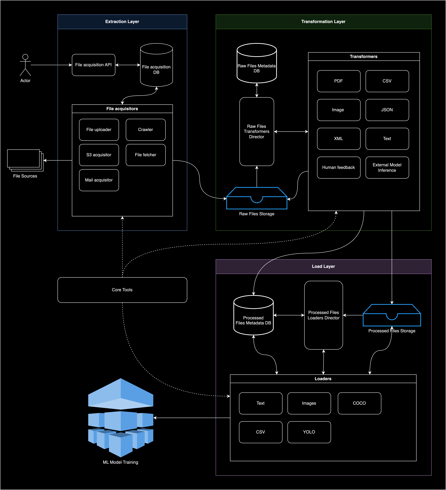

# Design Document: ETL System for Processing Diverse File Types for Machine Learning Training

## 1. Introduction

### 1.1 Purpose

This document outlines the design of an ETL (Extract, Transform, Load) system intended to process various file types—including PDFs, Emails, Images, and Raw Text—for the purpose of training machine learning models. The system aims to efficiently extract valuable information from heterogeneous data sources, normalize the data, and prepare it for ingestion into machine learning training pipelines.

### 1.2 Scope

The design covers:
- Ingestion mechanisms for different document formats.
- Extraction, transformation, and normalization processes.
- Identification of potential challenges and proposed solutions.
- Recommendations on technologies and tools for each component.

## 2. System Architecture Overview

### 2.1 High-Level Architecture Diagram

  

### 2.2 Components Overview

1. File Extraction Layer
2. File Transformation Layer
3. File Loading Layer
4. Core Tools

## 3. Detailed Components Description

### 3.1 File Extraction Layer

In this layer, we will be extracting files from various sources like local directories, cloud storage (e.g., AWS S3), or files in static file servers (e.g., GitHub). The extraction process involves reading the files and storing it in a cloud storage or a local file system.

#### 3.1.1 File Acquisition API

This API will be used to configure the file acquisition process, it should allow the user to specify the source of the files, what is the purpose of them, and how they should be processed.

#### 3.1.2 File Acquisitors Workers

The file acquisitors will be responsible for reading the files from the source and storing them in the cloud storage or local file system, those workers should be asynchronous and should be able to handle multiple files at the same time, some of the technologies that can be used for this are:

- Emails:
    - Parse email bodies, headers, and attachments using Python’s built-in email library or mailparser.
- Raw Text:
    - Read and preprocess text files using standard Python I/O operations.
- Cloud Storage:
    - Use Boto3 to interact with AWS S3 or Azure Blob Storage.

#### 3.1.3 Challenges and Solutions

- Challenge: Scalability in File Ingestion
    - Solution: Implement a scalable ingestion service using AWS Lambda for serverless ingestion.

### 3.2 File Transformation Layer

This layer focuses on the transformation or annotate files data. It includes the following functionalities:

#### 3.2.1 Raw Files Storage

Ideally should be a cloud storage service like AWS S3 or Azure Blob Storage, it should be capable of calling a lambda function every time a new file is uploaded to the storage.

#### 3.2.2 Raw Files Transformers Director

This service will be responsible to assign a transformer to each file type. The transformation proccess should be tracket by a database.

#### 3.2.3 Transformer Workers

Those will be services that will be responsible to transform the raw files into a standard format. The transformation process should be tracked by a database. some of the technologies that can be used for this are:

- PDF Processing:
    - PyPDF2: For text extraction from simple PDFs.
    - PDFMiner.six: For more complex PDFs and layout analysis.
- Email Parsing:
    - mailparser: Simplifies extraction of email components.
- OCR for Images:
    - Tesseract OCR: Open-source OCR engine.
    - pytesseract: Python wrapper for Tesseract.
    - OpenCV: For image preprocessing to improve OCR accuracy.
- Text Preprocessing:
    - NLTK or spaCy: For natural language processing tasks like tokenization, stemming, and lemmatization.
- Human feedback:
    - Label Studio: For labeling and annotating data.
- Model inference:
    - OpenAI API: For generating text from models.

#### 3.2.4 Challenges and Solutions

- Challenge: Low-Quality Images Affecting OCR
    - Solution: Enhance images using OpenCV before OCR processing.
- Challenge: Complex PDF Structures
    - Solution: Use PDFPlumber for detailed PDF parsing and extract tabular data.
- Challenge: Escalability
    - Solution: Use a queue system to process files in parallel.

### 3.3 File Load Layer

This layer loads processed data into target storage systems or databases, ensuring compatibility with specific formats (e.g., COCO, YOLO).

#### 3.3.1 Processed Files Loaders Director

This service will be responsible to assign a loader to each file type or asset.

#### 3.3.2 Challenges and Solutions

- Data Storage Solutions:
    - Apache Parquet: Columnar storage format optimized for analytical queries.
    - HDFS or Amazon S3: For scalable storage.
- Database Systems:
    - MongoDB: For unstructured or semi-structured data.
    - PostgreSQL: For structured data requiring complex queries.
- ML Framework Integration:
    - TensorFlow Data API: For efficient data feeding.
    - PyTorch DataLoader: For batch processing during training.
- Data Serialization:
    - Pandas DataFrame: For efficient data serialization.

### 4.3 Core Tools

This will be a package of tools that will be shared across the different layers. The main responsibility of this package will be define common patterns and nomenclature for the different layers. for instance: In the file extraction layer, we should have a common nomenclature to rename extracted files, in the transformation layer we should be able to get the matadata information from the file name.